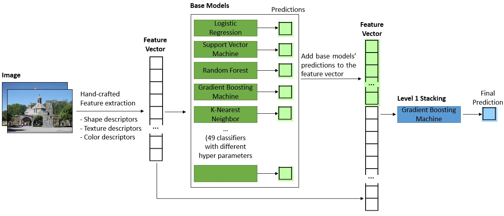
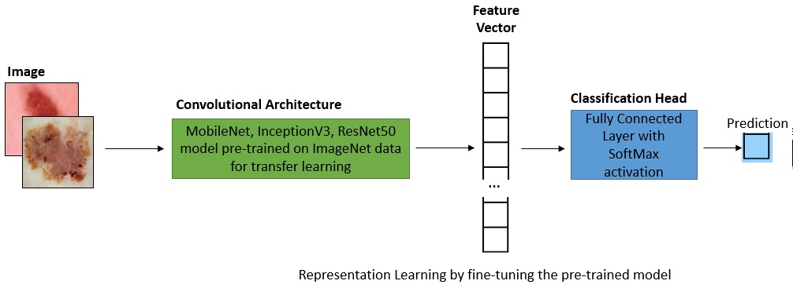

# SKIN LESION CLASSIFICATION
## Overview:
The project aims to build a classifier to process an image of a skin lesion and classify it into different types.

A small dataset with 2 classess (malignant and benign) is available at: https://www.kaggle.com/fanconic/skin-cancer-malignant-vs-benign. The dataset already have trainset and test set.<br/>
A larger dataset with multiple classes is available at: https://challenge2018.isic-archive.com/task3/<br/>
In this project, we run the code and report result on the small dataset, but the code works on multi-class dataset as well.

## Model Architecture
**1. Classical Machine learning with "Hand Crafted" image features**
<br/>

* We perform feature extraction by calculating global shape, texture, color descriptors (Hu Moments, Haralick features, Color Histogram) and local keypoint descriptors for the images. Many of these descriptors are translational, rotational and scale invariant.
* Using these "hand crafted" features, we train base models with different hyper parameters
* The predictions made by these base models are added to the feature space. We then train Level 1 Model Stacking using Cross-Validation on trainset

**2. Deep learning and Transfer learning to learn image features (representation learning with Convolutional Neural Network)**
<br/>

* Instead of "hand crafted" feature engineering, we can use convolutional neural network to learn feature represetnation of images. Since the number of images is not large, we will use transfer learning by fine-tuning backbones (e.g. MobileNet, InceptionV3, ResNet) that are already pre-trained on ImageNet data.
* We take out the top fully connected layer of these pre-trained model, add in a Global Average Pooling and a new classification head (a fully connected layer with softmax activation). Literature shows that Global Average Pooling helps reduce number of model parameters and still achieves good result. We first freeze weights of the backbone to only train the classification head, then we train all layers to fine-tune the model.
* Convolution operation is only translation invariant, but images in the dataset have different scales and orientations. We perform image augmentation during training to help the model generalize better.

## Model Performance
**1. Evaluation Metrics**

We will look at several evaluation metrics:
* **Accuracy**: Accuracy simply measures proportion of predictions that are correct. . It ranges between 0 (worst) and 1 (best)
* **F1-Score**: F1-Score is the harmonic mean of precision and recall. It ranges between 0 (worst) and 1 (best)
* **Cohen’s kappa**: Cohen’s kappa statistics measures how agreeable the prediction and the true label are. It ranges between -1 (completely disagree) and 1 (completely agree).

**2. Performance Report**

The models' performance on test set is reported below. The best model is a convolutional neural network with InceptionV3 backbone.

| Model  | Accuracy | F1-Score | Cohen’s kappa |
| ------ | -------- | -------- | ------------- |
| Logistics Regression | 0.838 | 0.838 | 0.674 |
| Support Vector Machine | 0.857 | 0.857 | 0.716 |
| Random Forest | 0.838 | 0.838 | 0.679 |
| Gradient Boosting Machine | 0.868 | 0.868 | 0.736 |
| K Nearest Neighbour | 0.808 | 0.805 | 0.606 |
| Stacking | 0.883 | 0.884 | 0.766 |
| MobileNet | 0.905 | 0.905 | 0.808 |
| InceptionV3 | 0.897 | 0.897 | 0.793 |
| ResNet50 | 0.911 | 0.911 | 0.820 |
<br/>

Confusion Matrix of the best model's prediction on test set:<br/>


## Instruction
**1. To install required Python packages:** Please run the following command from the repo directory:
```bash
pip install -r requirements.txt
```

**2. To train clasical machine learning and stacking models:** Please run the following command from the repo directory:
```bash
python models/stacking_model.py --data_path=/path/to/train-test-dataset/ --img_size=512 --n_splits=3 --save_path=/path/to/save/model/
```
Parameters:
* data_path: path to a folder that contains train and test sets
* img_size: image size to resize to. Smaller img_size leads to faster feature extraction but might lose details.
* n_splits: number of cross validation fold
* save_path: path to a folder to save fitted models. Base models will be saved to save_path/base_models, and stacking models will be saved to save_path/stacking_models

**3. To train convolutional neural network models:** Please run the following command from the repo directory:
```bash
python models/cnn_model.py --data_path=/path/to/train-test-dataset/ --batch_size=16 --nb_epochs=100 --lr=0.001 --save_path=/path/to/save/model/
```
Parameters:
* data_path: path to a folder that contains train and test sets
* batch_size: batch_size for model training. Larger batch_size leads to faster training but might cause out-of-memory.
* nb_epochs: number of epochs for model training
* lr: learning rate for model training
* save_path: path to a folder to save fitted models. Fitted models will be saved to save_path/cnn_models
